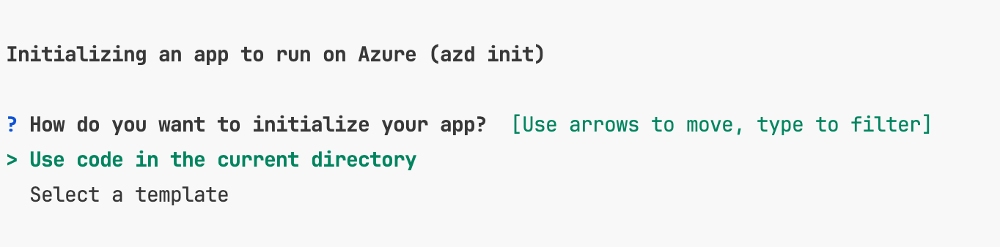
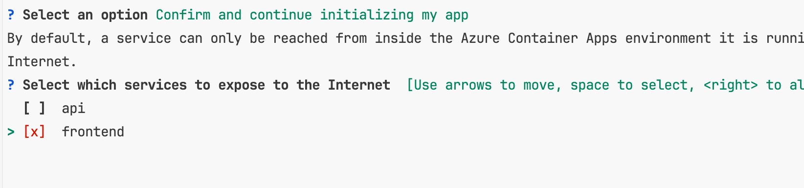

## Aspire

### Orchestration

.NET Aspire provides features for running and connecting multi-project applications and their dependencies.

* **App composition**: Specify the .net projects, containers, and cloud resources that make up your app.
* **Service discovery and connection string management**: The app host manages injecting the right connection strings
  and service discovery information to simplify the developer experience.


```bash
dotnet workload install aspire
```

```csharp
// Create a distributed application builder given the command line arguments.
var builder = DistributedApplication.CreateBuilder(args);

// Add a Redis container to the application.
var cache = builder.AddRedisContainer("cache");

// Add the frontend project to the application and configure it to use the 
// Redis container, defined as a referenced dependency.
builder.AddProject<Projects.MyFrontend>("frontend")
       .WithReference(cache);
```

### Components

[.NET Aspire components](https://learn.microsoft.com/en-us/dotnet/aspire/components-overview?tabs=dotnet-cli) are NuGet
packages for commonly used services, such as Redis or Postgres, with standardized
interfaces ensuring they connect consistently and seamlessly with your app.

Components automatically setup **Logging**, **Tracing**, **Metrics** and **Health Checks**.

Components also enable **Resiliency** and **Circuit Breaking**.


Example of components:
* PostgreSQL (with EF Core)
* SQL Server (with EF Core)
* CosmosDB
* Redis
* Redis Output Caching
* ServiceBus
* Blob Storage
* Storage Queues
* RabbitMQ

```bash
dotnet add package Aspire.Npgsql --prerelease
```

```csharp
builder.AddNpgsqlDataSource("PostgreSqlConnection")
```

AppSettings.json
```json
{
  "ConnectionStrings": {
    "PostgreSqlConnection": "Host=myserver;Database=test"
  }
}
```

```csharp
public class ExampleService(NpgsqlDataSource dataSource)
{
}
```

### Tooling

.NET Aspire comes with project templates and tooling experiences for Visual Studio and the dotnet CLI help you create
and interact with .NET Aspire apps.

### Deploying to Azure

```bash
azd init
```







```bash
azd up
```


To deploy code changes, run:
```bash
azd deploy
```

(If you get an error when deploying, make sure to login in to the container registry with:
az acr login -n <registry name>)


To deploy infrastructure changes, run:
```bash
azd provision
```

To create Github Actions, copy the workflow from 
[AZD Starter Bicep](https://github.com/Azure-Samples/azd-starter-bicep/blob/main/.github/workflows/azure-dev.yml) 
to .github/workflow folder and run:

```bash
azd pipeline config 
```

This will setup all secrets and variables needed for the pipeline to run.

Generate Bicep files used by AZD:
```bash
azd infra synth 
```

To delete all infra, run:
```bash
azd down
```

