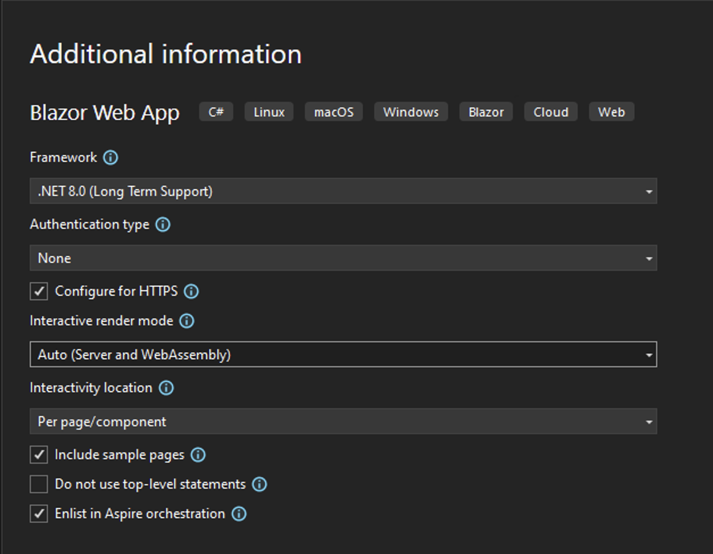
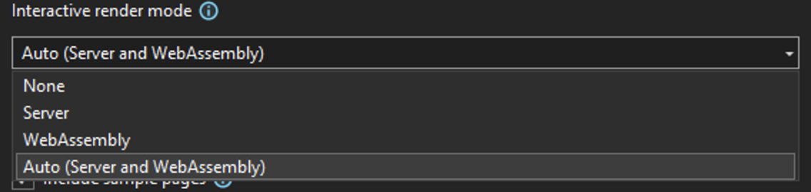
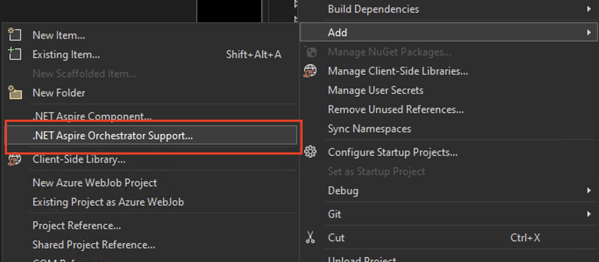
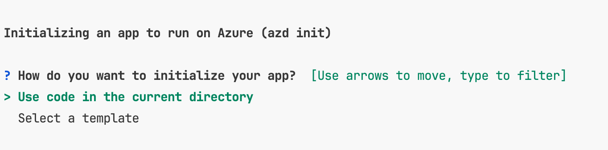
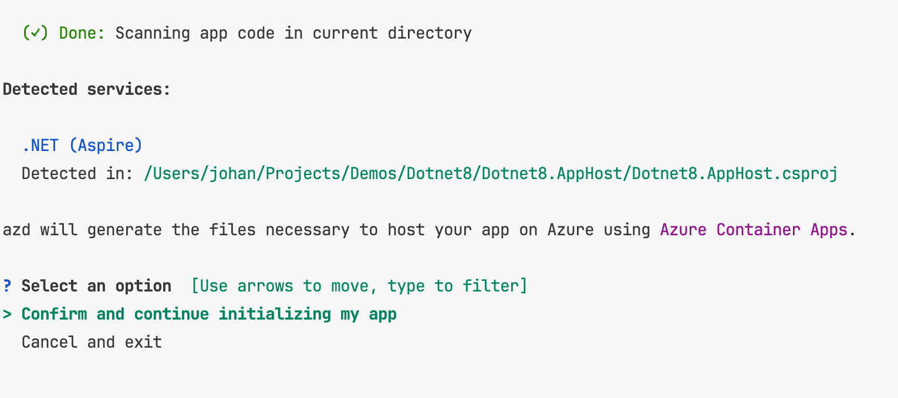
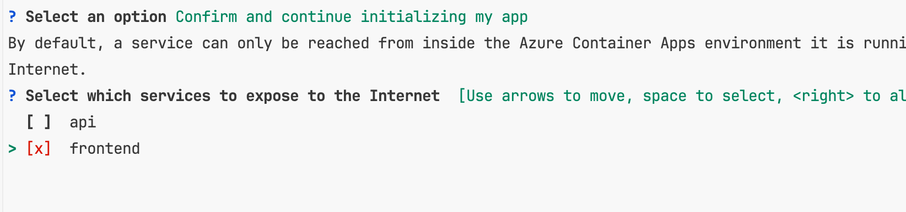
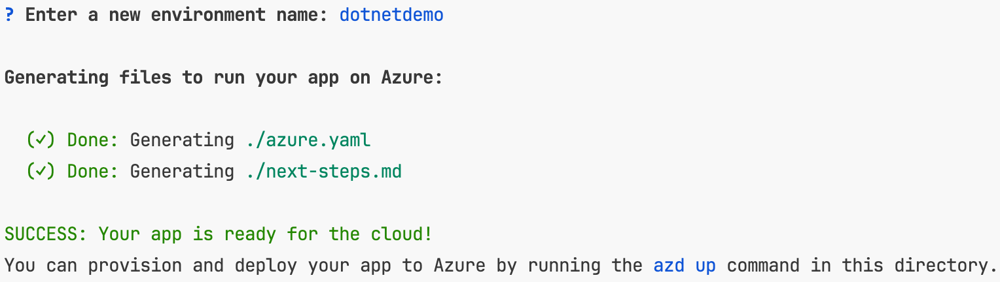
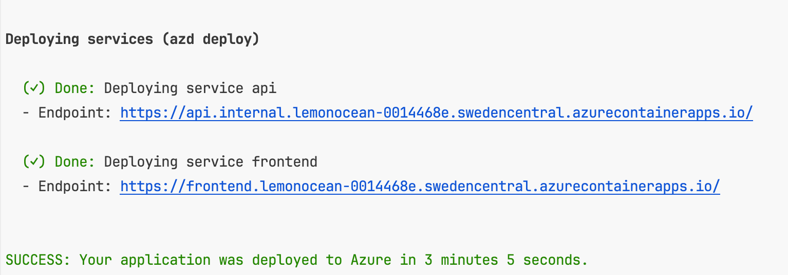

# What's new in .net 8

## C# 12

### Primary constructors

```csharp
// Old way
public class Person
{
    public Person(string name, int age)
    {
        Name = name;
        Age = age;
    }
    
    public string Name { get; set; }
    public int Age { get; set; }
}
```

```csharp
// New way
public class Person(string name, int age)
{
    public string Name { get; set; } = name;
    public int Age { get; set; } = age;
}
```

Perfect for dependency injection

```csharp  
public class UserController
{
    private readonly UserService _userService;
    private readonly ILogger<UserController> _logger;
    
    public UserController(UserService userService, ILogger<UserController> logger) {
        _userService = userService;
        _logger = logger;
    }
}
```

```csharp  
public class UserController(UserService userService, ILogger<UserController> logger)
{
}
```

### Collection Expressions

```csharp
int[] = [1, 2, 3, 4, 5];

// Empty array
public string[] CoolThings { get; set; } = [];

// Works with lists too
public List<string> CoolThings { get; set; } = [];

// Spread operator
int[] numbers = [1, 2, 3, 4, 5];
int[] moreNumbers = [0, ..numbers, 6, 7, 8, 9]; // Note the .. operator

```

### Switch expressions

(Actually C# 11, but still worth mentioning)

```csharp

public string GetDayOfWeek(int day)
{
    return day switch
    {
        1 or 7 => "Weekend",
        2..6 => "Weekday",
        _ => throw new ArgumentException("Invalid day of week")
    };
}

public string Suffix(int number)
{
    return number switch
    {
        1 => "st",
        2 => "nd",
        3 => "rd",
        >= 4 and <= 20 => "th",
        _ => Suffix(number % 10)
    };
}

public string Family(string[] names) {
    return names switch
    {
        // Array contains exactly one element
        [name] => $"{name} is an only child",
        // Array contains exactly two elements
        [child1, child2] => $"The family has two children: {child1} and {child2}",
        // Array contains more than two elements, but less than four
        [child1, ..others] when others.length < 4 => $"{child1} is the oldest child and has {others.Length} siblings",
        // "else" case
        _ => "The family is too big to keep track of"
    };
}
```

### Null type checking

```csharp
public class Person
{
    public required string Name { get; set; }
    public string? FavoriteColor { get; set; }
}
```

### ?? and ??= operators

```csharp
string name = null;
string otherName = name ?? "John Doe";

// Same as
string otherName = name != null ? name : "John Doe";

// ??= operator
name ??= "John Doe";

// Same as
if (name == null)
{
    name = "John Doe";
}
```

## Blazor

* Unified web app template
* Static server side rendering





## Aspire

### Orchestration

.NET Aspire provides features for running and connecting multi-project applications and their dependencies.

* **App composition**: Specify the .net projects, containers, and cloud resources that make up your app.
* **Service discovery and connection string management**: The app host manages injecting the right connection strings
  and service discovery information to simplify the developer experience.



```bash
dotnet workload install aspire
```

```csharp
// Create a distributed application builder given the command line arguments.
var builder = DistributedApplication.CreateBuilder(args);

// Add a Redis container to the application.
var cache = builder.AddRedisContainer("cache");

// Add the frontend project to the application and configure it to use the 
// Redis container, defined as a referenced dependency.
builder.AddProject<Projects.MyFrontend>("frontend")
       .WithReference(cache);
```

### Components

[.NET Aspire components](https://learn.microsoft.com/en-us/dotnet/aspire/components-overview?tabs=dotnet-cli) are NuGet
packages for commonly used services, such as Redis or Postgres, with standardized
interfaces ensuring they connect consistently and seamlessly with your app.

Components automatically setup **Logging**, **Tracing**, **Metrics** and **Health Checks**.

Components also enable **Resiliency** and **Circuit Breaking**.


Example of components:
* PostgreSQL (with EF Core)
* SQL Server (with EF Core)
* CosmosDB
* Redis
* Redis Output Caching
* ServiceBus
* Blob Storage
* Storage Queues
* RabbitMQ

```bash
dotnet add package Aspire.Npgsql --prerelease
```

```csharp
builder.AddNpgsqlDataSource("PostgreSqlConnection")
```

AppSettings.json
```json
{
  "ConnectionStrings": {
    "PostgreSqlConnection": "Host=myserver;Database=test"
  }
}
```

```csharp
public class ExampleService(NpgsqlDataSource dataSource)
{
}
```

### Tooling

.NET Aspire comes with project templates and tooling experiences for Visual Studio and the dotnet CLI help you create
and interact with .NET Aspire apps.

### Deploying to Azure

```bash
azd init
```










```bash
azd up
```



To deploy code changes, run:
```bash
azd deploy
```

(If you get an error when deploying, make sure to login in to the container registry with:
az acr login -n <registry name>)


To deploy infrastructure changes, run:
```bash
azd provision
```

To create Github Actions, run:
```bash
mkdir .github/workflow
azd pipeline config 
```

To delete all infra, run:
```bash
azd down
```

